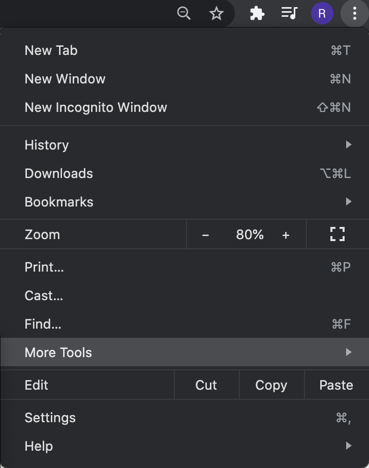
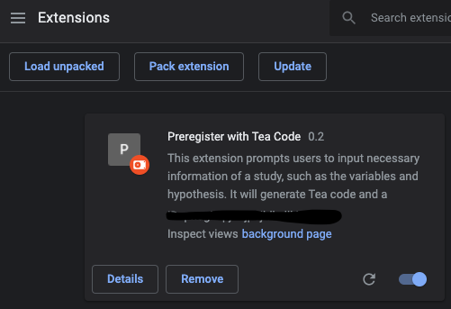
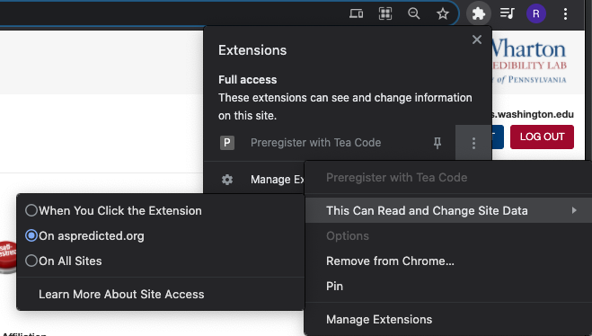

# tea-frontend

# Install Preregistea

Clone this repository or download the zip file

# Load the plugin on your Chrome browser

* Click `extensions` under `More Tools` on the top right of your Chrome browser.

* Click `Load unpacked` at the top left of the Extension page.

* Select the `extension` folder under the repository/zip file you just downloaded.

# Use the Plugin on AsPredicted.org

* Create an AsPredicted account if you don't have one.
* Go to https://aspredicted.org/create.php and start use Preregistea to preregister your study.
* Make sure that you give access to the plugin.